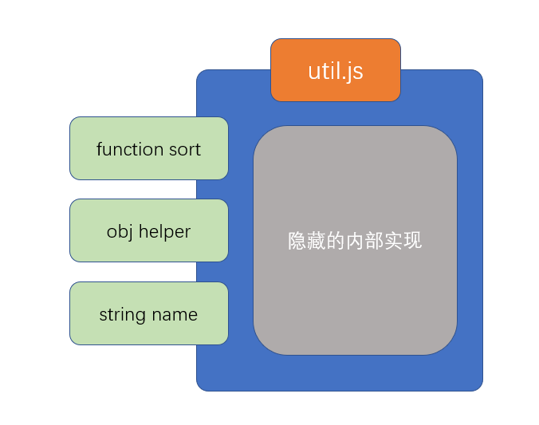

# CommonJS

在nodejs中，由于有且仅有一个入口文件（启动文件），而开发一个应用肯定会涉及到多个文件配合，因此，nodejs对模块化的需求比浏览器端要大的多


由于nodejs刚刚发布的时候，前端没有统一的、官方的模块化规范，因此，它选择使用社区提供的CommonJS作为模块化规范

在学习CommonJS之前，首先认识两个重要的概念：**模块的导出**和**模块的导入**

## 模块的导出

要理解模块的导出，首先要理解模块的含义

什么是模块？

模块就是一个JS文件，它实现了一部分功能，并隐藏自己的内部实现，同时提供了一些接口供其他模块使用

模块有两个核心要素：**隐藏**和**暴露**

隐藏的，是自己内部的实现

暴露的，是希望外部使用的接口

任何一个正常的模块化标准，都应该默认隐藏模块中的所有实现，而通过一些语法或api调用来暴露接口

**暴露接口的过程即模块的导出**



## 模块的导入

当需要使用一个模块时，使用的是该模块暴露的部分（导出的部分），隐藏的部分是永远无法使用的。

**当通过某种语法或api去使用一个模块时，这个过程叫做模块的导入**

## CommonJS规范

CommonJS使用```exports```导出模块，```require```导入模块

具体规范如下：

1. 如果一个JS文件中存在```exports```或```require```，该JS文件是一个模块
2. 模块内的所有代码均为隐藏代码，包括全局变量、全局函数，这些全局的内容均不应该对全局变量造成任何污染
3. 如果一个模块需要暴露一些API提供给外部使用，需要通过```exports```导出，```exports```是一个空的对象，你可以为该对象添加任何需要导出的内容
4. 如果一个模块需要导入其他模块，通过```require```实现，```require```是一个函数，传入模块的路径即可返回该模块导出的整个内容
5. nodejs中导入模块，使用相对路径，并且必须以./或../开头，否则会直接从node_modules导入。


## nodejs对CommonJS的实现

为了实现CommonJS规范，nodejs对模块做出了以下处理

1. 为了保证高效的执行，仅加载必要的模块。nodejs只有执行到```require```函数时才会加载并执行模块
2. 为了隐藏模块中的代码，nodejs执行模块时，会将模块中的所有代码放置到一个函数中执行，以保证不污染全局变量。
   ```js
    (function(){
        //模块中的代码
    })()
   ```

3. 为了保证顺利的导出模块内容，nodejs做了以下处理
   1. 在模块开始执行前，初始化一个值```module.exports = {}```
   2. ```module.exports```即模块的导出值
   3. 为了方便开发者便捷的导出，nodejs在初始化完```module.exports```后，又声明了一个变量```exports = module.exports```
   
   ```js
    (function(module){
        module.exports = {};
        var exports = module.exports;
        //模块中的代码
        return module.exports;
    })()
   ```
4. 为了避免反复加载同一个模块，nodejs默认开启了模块缓存，如果加载的模块已经被加载过了，则会自动使用之前的导出结果