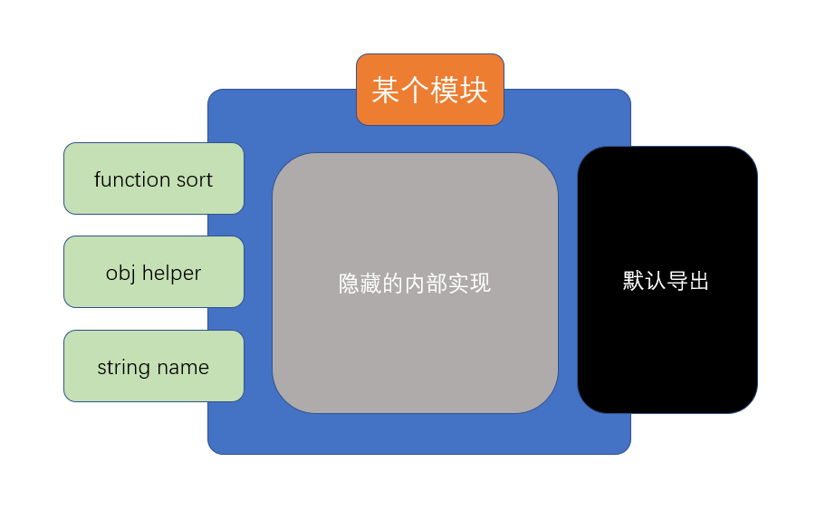

# 基本导入导出

## 模块的引入

**注意：这一部分非模块化标准**

目前，浏览器使用以下方式引入一个ES6模块文件，在模块内声明的变量无法在全局访问（防止污染全局变量）

```html
<script src="入口文件" type="module">
```

## 模块的基本导出和导入

ES6中的模块导入导出分为两种：

1. 基本导入导出
2. 默认导入导出



### 基本导出

类似于 ``` exports.xxx = xxxx ```

基本导出可以有多个，每个必须有名称

基本导出的语法如下：

```js
export 声明表达式
```

或

```js
export {具名符号}
// export {具名符号 as name} 导出的名字重命名
```

由于基本导出必须具有名称，所以要求导出内容必须跟上**声明表达式**或**具名符号**

### 基本导入

由于使用的是**依赖预加载**，因此，导入任何其他模块，导入代码必须放置到所有代码之前(浏览器在预编译时，会自动把导入语句放在代码顶部)

对于基本导出，如果要进行导入，使用下面的代码

```js
import {导入的符号列表} from "模块路径" 
```

注意以下细节：
- 导入时，可以通过关键字```as```对导入的符号进行重命名（解决命名冲突）（导出时也可以）
- 导入时使用的符号是常量，不可修改
- 可以使用*号导入所有的基本导出，形成一个对象

重复导入,浏览器是有缓存的,只会导入一次

```js
import "./b.js" //这条导入语句，仅会运行模块，不适用它内部的任何导出
```